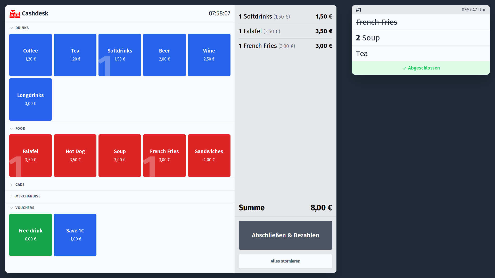

# Cashdesk

A very simple cashdesk application to make calculation of prices and keeping track of orders easier. The application allows you to dynamically load products and categories from a YAML file. Orders can be taken via large, touch-friendly buttons and the check-out process is straight forward. The application is built with [SvelteKit](https://kit.svelte.dev), [Tailwind CSS](https://tailwindcss.com) and [Tauri](https://tauri.app).



## Features

This application is indeed very simple and does not have many features. However, it is designed to be easily extendable and customizable.

It is touch-friendly and can be used on a tablet or a touch screen. The application is designed to be used in a shop or a café, where you want to quickly take orders and calculate the total price. It gives a nice overview of the pending orders to keep track which products have to be prepared.

To add an item to the order, simply click on the corresponding button. To remove an item, click on the item's name in the light gray area to the right. To remove all items, click on the "Alles stornieren" button. To proceed to checkout, click the "Abschließen & Bezahlen" button.

All payed orders appear on the right of the screen. To mark a single item as delivered, click on the item's name. It will add a strikt through the item's name. Click again to remove the strike through. To mark the whole order as delivered, click on the "Abgeschlossen" button two times. It will dissapear from the list.

> [!IMPORTANT]  
> The application **does not** save any kind of information – neither the taken orders, revenue or any kind of statistics. Once the app is closed, all data is gone! It is, for example, not compliant to the German "Kassensicherungsverordnung" (KassenSichV) or any other fiscal law and does not feature a "Technische Sicherheitseinrichtung" (TSE). Think of it more as a calculator than a cash register.

## Configuration

Please see `config-example.yaml` for an example configuration file. The configuration file can be selected and loaded after the application has started.

## Developing

Once you've downloaded or cloned the procejt, install dependencies with `npm install` (or `pnpm install` or `yarn`).
You can then start a development server:

```bash
npm run tauri dev
```

## Building

To create a production version of the app:

```bash
npm run tauri build
```

## Acknowledgements

The images of Euro [bank notes](https://www.ecb.europa.eu/euro/banknotes/images/html/index.en.html) and [coins](https://www.ecb.europa.eu/euro/coins/common/html/index.en.html) are provided by the European Central Bank. Article 2 of [Decision ECB/2013/10](https://eur-lex.europa.eu/legal-content/EN/TXT/HTML/?uri=CELEX:02013D0010-20210104&from=EN#tocId4) as well as the [Copyright and reproduction rules of euro coins and notes](https://economy-finance.ec.europa.eu/euro/euro-coins-and-notes/copyright-and-reproduction-rules-euro-coins-and-notes_en) and [§ 5 UrhG](https://www.gesetze-im-internet.de/urhg/__5.html) _should_ allow the usage of the images in this app. If in doubt, please consider replacing the images in `static/money`.

The logo was made by [Clker-Free-Vector-Images](https://pixabay.com/de/users/clker-free-vector-images-3736/?utm_source=link-attribution&utm_medium=referral&utm_campaign=image&utm_content=312358) and published on [Pixabay](ttps://pixabay.com/de//?utm_source=link-attribution&utm_medium=referral&utm_campaign=image&utm_content=312358).
